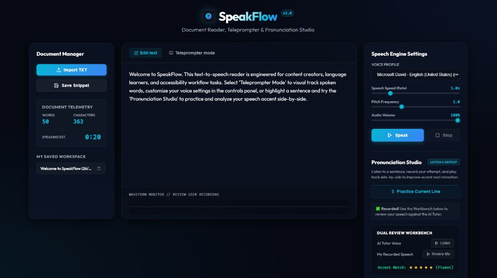

# 🎙️ SpeakFlow: Professional Text-to-Speech Reader & Teleprompter Studio

> An advanced, distraction-free document reader, auto-scrolling teleprompter, and pronunciation trainer powered by modern Web Speech & Audio APIs.

[](#)
[](#)
[](#)
[](#)



---

## 💎 Core Features

### 1. Document Manager & Telemetry
* Import standard `.txt` text files directly into the editor workspace.
* Real-time document metrics: Displays character count, word count, and dynamically updates estimated speaking duration scaled to playback speed.
* Snippets library: Caches saved scripts and articles locally in the browser (`localStorage`) for offline bookmarks and fast workspace reloading.

### 2. Auto-Scrolling Teleprompter Mode
* Toggle from the standard text editor to a clean, distraction-free reading viewport.
* Synchronized visual word-by-word highlighting utilizing the Web Speech API's native `onboundary` event tracking.
* Dynamic teleprompter auto-scrolling that tracks voice delivery and centers active words.
* Customizable reading parameters: font sizing adjustments and multiple contrast themes (Dark default, Sepia book-view, and High-Contrast Black & Yellow).

### 3. Speech Engine Settings
* Support for all system-installed synthesized voice profiles, grouped by language and locale.
* Hardware-level adjustments for playback **Speed Rate** (from 0.5x up to 3.0x), **Vocal Pitch**, and **Audio Volume**.

### 4. Pronunciation Studio (Listen & Repeat)
* Practice reading lines or sentences with a comparative AI-Tutor review workflow.
* Listens to the tutor voice, records your microphone attempt in real-time, and generates a side-by-side comparative playback board (Original Voice vs User Recording).
* Generates fluent matching ratings for pronuncation accuracy based on delivery comparisons.

### 5. Canvas Waveform Monitor
* Dynamic canvas visualizer drawing custom wave oscillations when the synthesizer is reading text.
* Utilizes Web Audio API `AudioContext` and `AnalyserNode` to capture and render true waveform patterns when you record your microphone.

---

## 🛠️ Technology Stack
SpeakFlow runs completely client-side with zero dependencies, framework overhead, or compilation requirements:
* **HTML5**: Semantic tags, clean forms, and hidden canvas containers.
* **Vanilla CSS**: Responsive grids, dark cybernetic color variables, smooth active animations, and custom slider scroll bars.
* **ES6+ JavaScript**: Native browser integrations for `SpeechSynthesis`, `MediaRecorder` buffers, `AudioContext` filters, and offline storage.

---

## 🚀 Getting Started

SpeakFlow is a self-contained web app that can be run directly inside any modern browser.

### Local Run
Simply double-click the `index.html` file to open it, or run a simple local web server:

**Using Node.js:**
```bash
npx serve .
```

**Using Python:**
```bash
python -m http.server 8000
```
Then navigate to `http://localhost:8000` (or the corresponding port) in Chrome, Edge, Safari, or Firefox.

---

## 📄 License
This project is open-source and available under the [MIT License](LICENSE).
